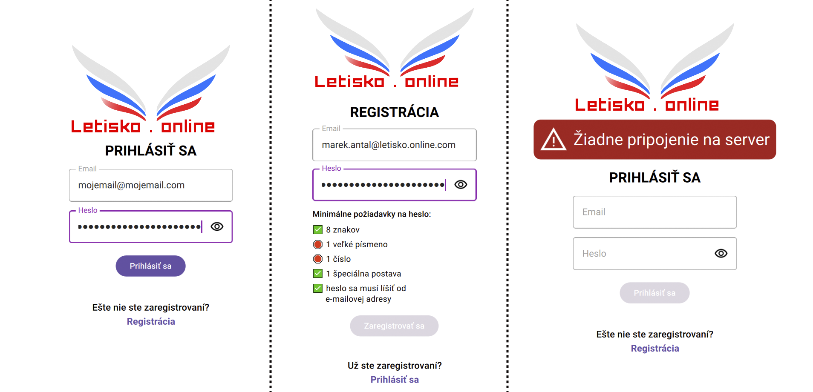
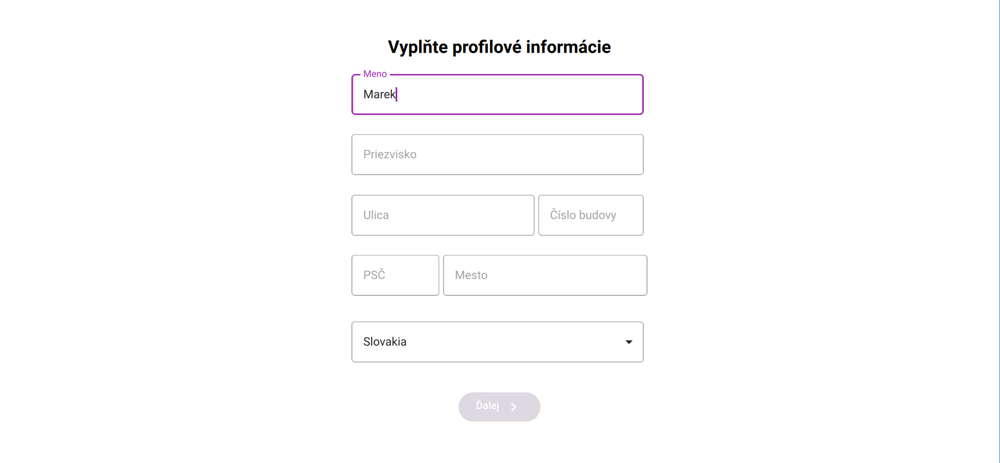
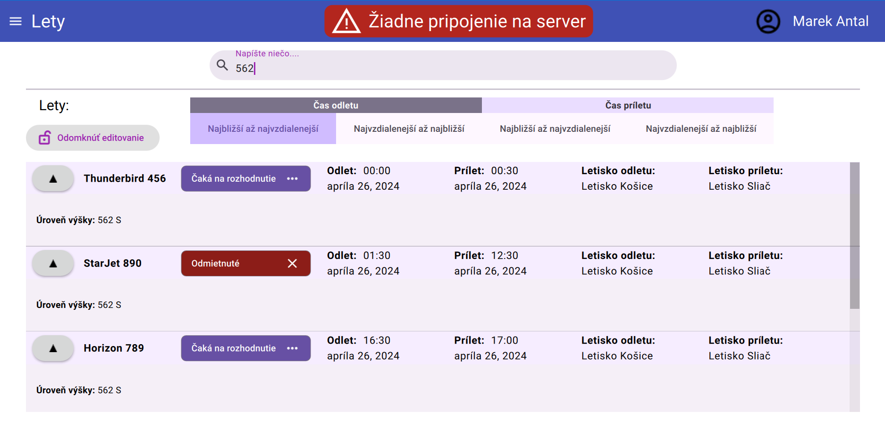
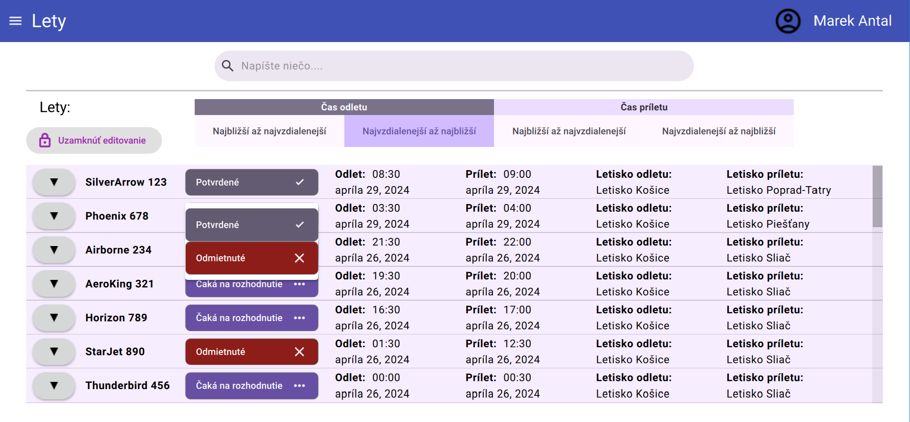
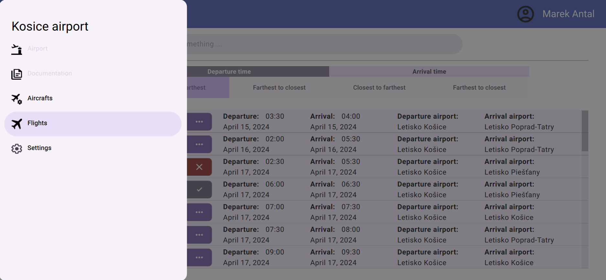
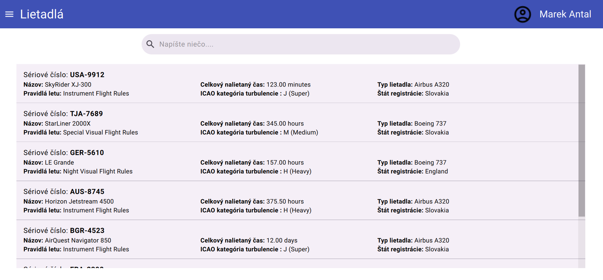
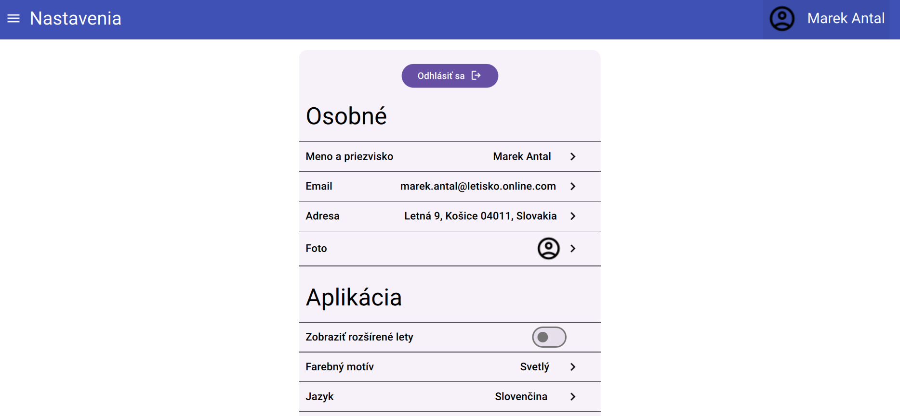

## Name
Letisko online Android tablet client

## Description
The app is primarily designed for use on Android tablets in landscape orientation, but can also be compiled for use on other operating systems like Windows.

## Project status
The project is ready to use, but has prepared parts of the code that can be improved when finalizing the server API, such parts are marked as
**// #TODO: RELEASE_ON_FURURE_API_IMPROVEMENT**

## Before compiling and launching
- provide a server IP address by setting up the **SERVER_NETWORK_ADDRESS** constant value in the file constants.cpp

## Installation
Project requires Qt version 6.6 as well as C++ 20,general project configuration can be found in CMakeLists.txt, for Android builds ./android/AndroidManifest.xml

## Visuals

  
  
  
  
  
  
  

## Video

